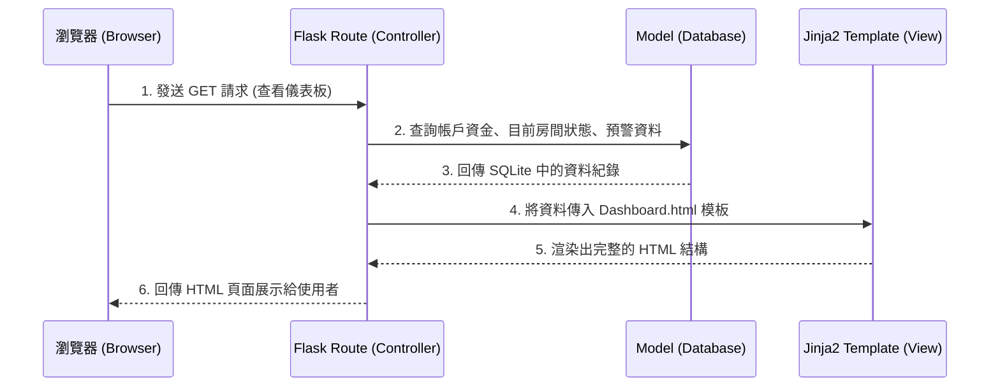

# 賽特選房系統 - 系統架構文件

本文件依據 `docs/PRD.md` 的功能與非功能需求，定義了「賽特選房系統」的整體技術架構規劃，作為後續開發與實作的基礎。

## 1. 技術架構說明

根據專案需求與限制，本系統不採用近年流行的前後端分離架構，而是採用傳統但穩定且開發快速的「伺服器端渲染」架構。

### 選用技術與原因
- **後端框架：Python (Flask)**
  - **原因**：Flask 輕量且極具彈性，非常適合中小型專案或 MVP 開發。Python 本身具備強大的數據處理能力，這對於實作本專案核心的「選房演算法」與「快爆分監測」非常有優勢。
- **模板引擎：Jinja2**
  - **原因**：與 Flask 緊密整合，能在伺服器端將動態資料（如獲利數字、風險狀態）直接注入 HTML 頁面中，這對於不需要複雜 SPA (Single Page Application) 互動的儀表板來說開發效率最高。
- **資料庫：SQLite (透過 SQLAlchemy)**
  - **原因**：由於這是一個 MVP，SQLite 為輕量級檔案資料庫，不需額外架設資料庫伺服器（如 MySQL/PostgreSQL），便於快速測試與部署。後續若需要擴展也可直接藉由 SQLAlchemy 輕易抽換為其他關聯式資料庫。

### Flask MVC 模式說明
系統基於 **MVC (Model-View-Controller)** 核心思想設計：
- **Model (模型)**：負責與 SQLite 溝通及商業邏輯的處理，包含使用者資料、房間狀態、停損設定、以及資金的操作。
- **View (視圖)**：以 Jinja2 與 HTML/CSS 構成，負責將處理好的結果（如盈虧報表、預警通知）顯示給瀏覽器端的使用者。
- **Controller (控制器 / 路由 Route)**：以 Flask 的 Routing 實作。負責接收使用者的要求（如網頁請求、出金申請），呼叫對應的 Model 處理資料，最後把結果交給 View 產生網頁。

---

## 2. 專案資料夾結構

專案採用以下資料夾結構，以保持程式碼乾淨、好維護：

```text
web_app_development/
├── app/                        ← 應用程式主目錄 (Flask 核心)
│   ├── models/                 ← 資料庫模型 (Model)
│   │   ├── __init__.py
│   │   ├── user.py             ← 使用者帳號與資金餘額模型
│   │   ├── room.py             ← 房間狀態與選房歷史模型
│   │   └── transaction.py      ← 出金申請與交易紀錄模型
│   ├── routes/                 ← Flask 路由 (Controller)
│   │   ├── __init__.py
│   │   ├── main.py             ← 首頁與綜合儀表板
│   │   ├── auth.py             ← 登入/註冊/權限管理
│   │   ├── bot.py              ← 選房、自動設定停損點、自動掛機相關操作
│   │   └── finance.py          ← 出金申請管理
│   ├── templates/              ← HTML 頁面與 Jinja2 模板 (View)
│   │   ├── base.html           ← 共用的母版佈局 (Header, Sidebar)
│   │   ├── dashboard.html      ← 首頁儀表板 (資金、獲利、警報)
│   │   ├── rooms.html          ← 智能選房與掛機設定介面
│   │   └── withdrawal.html     ← 出金申請頁面
│   ├── static/                 ← 靜態資源檔案
│   │   ├── css/
│   │   │   └── style.css       ← 自訂網頁樣式
│   │   └── js/
│   │       └── script.js       ← 增加簡易前端互動 (如警報彈窗、圖表顯示)
│   ├── utils/                  ← 共用工具模組
│   │   ├── algorithm.py        ← 選房演算法與爆分偵測邏輯包裝
│   │   └── notification.py     ← 通知推播工具 (信件或 Webhook)
│   └── __init__.py             ← 初始化 Flask App, SQLAlchemy 等套件
├── instance/                   ← 實例專用資料 (敏感資訊與本機資料)
│   └── database.db             ← SQLite 本機資料庫存放處
├── docs/                       ← 專案文件目錄
│   ├── PRD.md                  ← 產品需求文件
│   └── ARCHITECTURE.md         ← 系統架構文件 (本文件)
├── requirements.txt            ← Python 套件相依清單 (Flask, SQLAlchemy 等)
└── app.py                      ← 系統進入點 (啟動 Flask Server)
```

---

## 3. 元件關係圖

以下展示一組典型的使用者請求（如：查看儀表板資金與快爆分警報）在系統中的資料流：



---

## 4. 關鍵設計決策

以下列出本專案 4 項最重要的技術決策及原因：

1. **Flask Blueprint 路由拆分**
   - **決策**：不把所有 `@app.route` 寫在一個 `app.py` 中，而是分成 `main`, `auth`, `bot`, `finance`。
   - **原因**：選房邏輯與出金邏輯複雜度較高，為了讓不同模組間不會互相干擾且利於未來團隊分工，採用 Blueprint 來模組化。
2. **共用演算法模組 (utils/algorithm.py)**
   - **決策**：將「選房演算法」與「快爆分監控邏輯」抽離出 Controller，獨立存放於 `utils` 資料夾。
   - **原因**：為了隨時能單獨對演算法進行單元測試與除錯，而不是跟網頁的 Request / Response 卡在一起，保持商業邏輯的純淨性。
3. **安全第一的資金操作設計**
   - **決策**：所有關於「穩定出金」、「停損點觸發」的資料變動，在 Model 層都使用事務（DB Transaction）保護。
   - **原因**：避免系統在進行資金扣除或狀態改變到一半時當機，導致數字錯亂甚至虧本的狀況。
4. **伺服器端渲染 (SSR) 取代 SPA**
   - **決策**：決定將資料整理好後交給 Jinja2 渲染 HTML，而非全靠前端 React/Vue 接 API。
   - **原因**：系統開發重點在於演算法穩定性與風險控管，對於初版 (MVP) 來說，避免多引入一套複雜的前端構建環境，可以全心聚焦於核心價值的實現。
