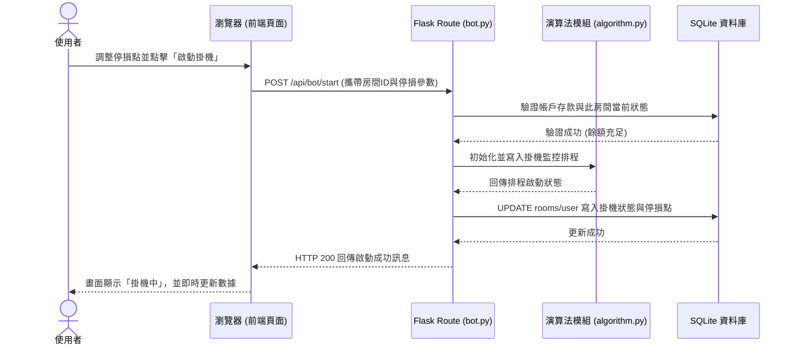

# 賽特選房系統 - 流程圖文件 (FLOWCHART)

本文件依據 PRD 與技術架構設計，將系統的核心操作邏輯視覺化，包含使用者的操作路徑與系統內的資料流動方式。

## 1. 使用者流程圖 (User Flow)

描述使用者登入系統後，如何前往不同功能模組進行智能選房、設定停損、開啟自動掛機與進行出金。

```mermaid
flowchart LR
    A([使用者登入網站]) --> B[首頁儀表板 / Dashboard]
    
    B --> C{選擇功能模組}
    
    C -->|分析與選房| D[房間列表與智能推薦]
    D --> E[進入個別房間設定]
    E --> F[設定預期停損點]
    F --> G[啟動自動操作 (掛機模式)]
    G --> H[系統後台監控與操作]
    H -.->|快爆分警報推播| B
    
    C -->|資金管理| I[財務與出金管理]
    I --> J[填寫出金申請]
    J --> K[系統檢核水位與餘額]
    K -->|檢核通過| L([完成出金手續])
    K -->|檢核失敗| M([提示失敗並退回紀錄])
```

## 2. 系統序列圖 (Sequence Diagram)

以下以「使用者啟動自動操作與停損點」為例，描述資料如何在前端瀏覽器、Flask 路由、後端演算法與資料庫間傳遞。



## 3. 功能清單對照表

將 PRD 的主要功能對應到 Flask 的 URL 路徑以及 HTTP 方法，做為後續實作（API 設計）的準備參考：

| 功能描述 | URL 路徑 | HTTP 方法 | 對應控制器 (Route) |
| :--- | :--- | :--- | :--- |
| **首頁儀表板** (查看資金與整體狀態) | `/` | `GET` | `routes/main.py` |
| **智能推薦房間列表** | `/rooms` | `GET` | `routes/main.py` |
| **啟動房間掛機與設定停損** | `/api/bot/start` | `POST` | `routes/bot.py` |
| **停止掛機** | `/api/bot/stop` | `POST` | `routes/bot.py` |
| **獲取快爆分警報** (前端輪詢使用) | `/api/alerts` | `GET` | `routes/bot.py` |
| **出金申請頁面** | `/finance/withdrawal` | `GET` | `routes/finance.py` |
| **提交出金申請** | `/finance/withdrawal` | `POST` | `routes/finance.py` |
| **通知處理 Webhook / 背景更新** | `/api/webhook` | `POST` | `routes/main.py` |
